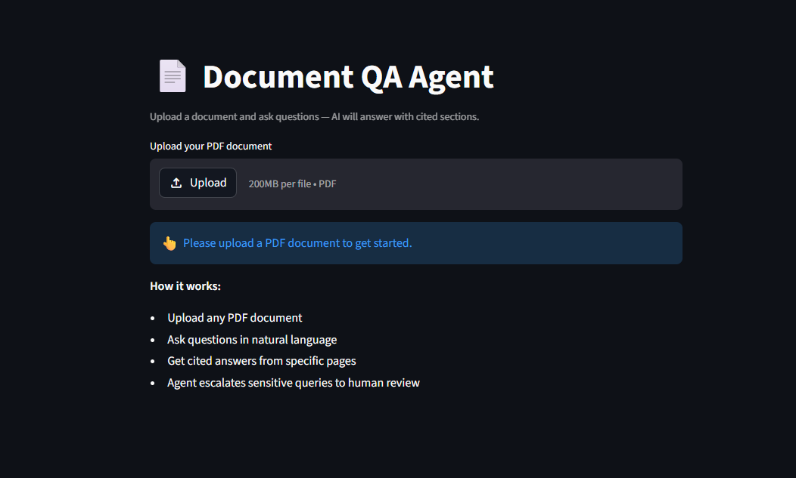
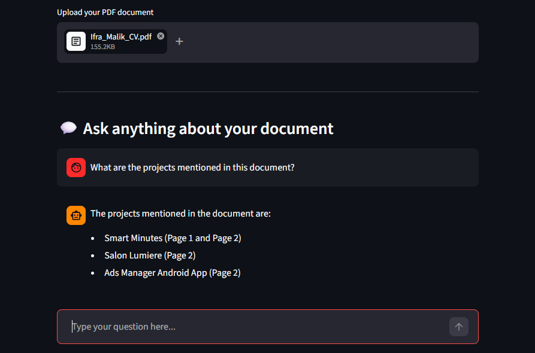
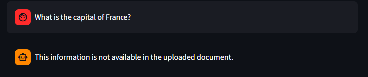
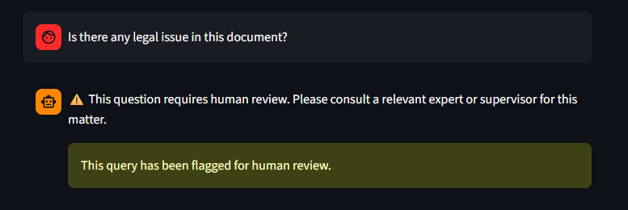
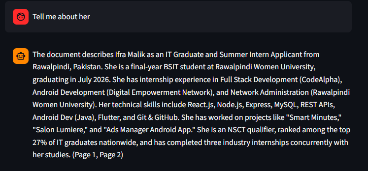

# 📄 Document QA Agent

An AI-powered agent that lets you upload any PDF document and ask questions in natural language. The agent answers with cited page references and knows when to escalate sensitive queries to human review.

🔗 **Live Demo:** [document-app-agent.streamlit.app](https://document-app-agent.streamlit.app/)

---

## 🤖 What This Agent Does

- Accepts any PDF document as input
- Answers questions strictly based on document content
- Cites specific page numbers in every answer
- Handles messy or unclear questions gracefully
- Escalates sensitive queries (legal, emergency, critical) to human review
- Maintains conversation history for follow-up questions

---

## 🧠 How It Works

```
User uploads PDF
      ↓
PyPDF2 extracts text page by page
      ↓
User asks a question
      ↓
Agent checks for escalation keywords
      ↓
If safe → builds prompt with document context + chat history
      ↓
Sends to LLM via OpenRouter API
      ↓
Returns cited answer with page numbers
      ↓
If sensitive → escalates to human review ⚠️
```

---

## 🛠️ Tech Stack

| Tool | Purpose |
|------|---------|
| Python | Core language |
| Streamlit | UI and deployment |
| OpenRouter API | LLM inference |
| PyPDF2 | PDF text extraction |
| python-dotenv | Environment variables |

---

## 🚀 Run Locally

**1. Clone the repository**
```bash
git clone https://github.com/yourusername/document-qa-agent.git
cd document-qa-agent
```

**2. Install dependencies**
```bash
pip install -r requirements.txt
```

**3. Create .env file**
```
OPENROUTER_API_KEY=your_api_key_here
```

**4. Run the app**
```bash
streamlit run app.py
```

---

## 🔑 Get Your API Key

1. Go to [openrouter.ai](https://openrouter.ai)
2. Sign up for free
3. Go to API Keys
4. Create a new key
5. Paste it in your `.env` file

---

## 💡 Example Use Cases

- Ask questions about a research paper
- Extract key points from a policy document
- Query your CV or resume
- Analyze legal documents (with human escalation)
- Summarize reports

---
## 📸 Screenshots

### 🏠 Home Screen


### 💬 Document Upload Interface


### 📑 Answer with Citation


### 📑 Answer with Citation

### 📑 Answer with Citation


## ⚙️ Agent Decision Logic

| Situation | Agent Action |
|-----------|-------------|
| Question answered in document | Returns answer with page citation |
| Information not in document | Clearly states not available |
| Sensitive/legal query | Escalates to human review |
| Messy or unclear input | Asks for clarification |
| Ambiguous question | Requests more details |

---

## 👩‍💻 Author

**Ifra Malik**
- GitHub: [github.com/ifra489](https://github.com/ifra489)
- LinkedIn: [linkedin.com/in/ifra-malik-09236836a](https://linkedin.com/in/ifra-malik-09236836a)

---


